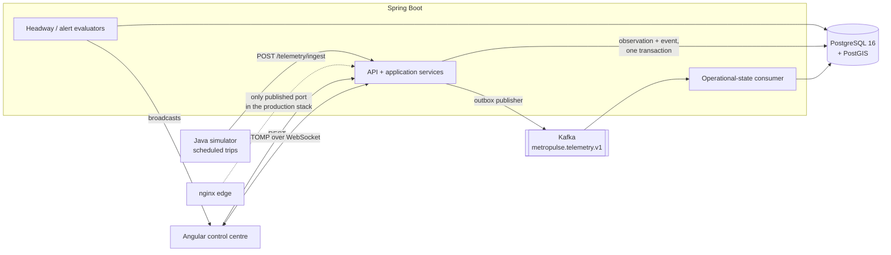
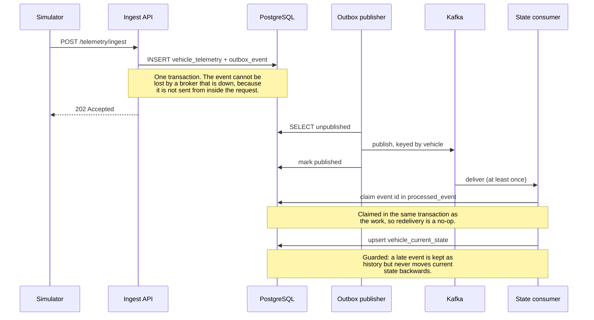
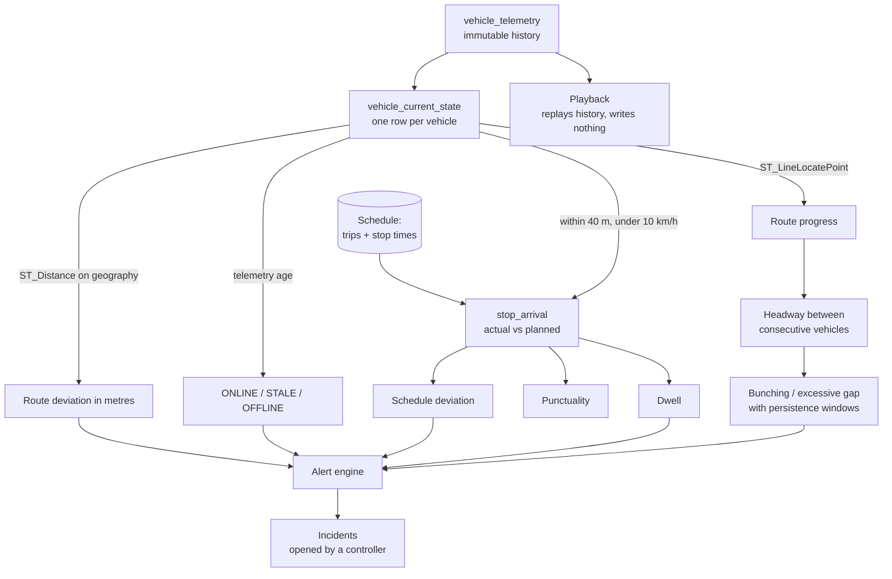
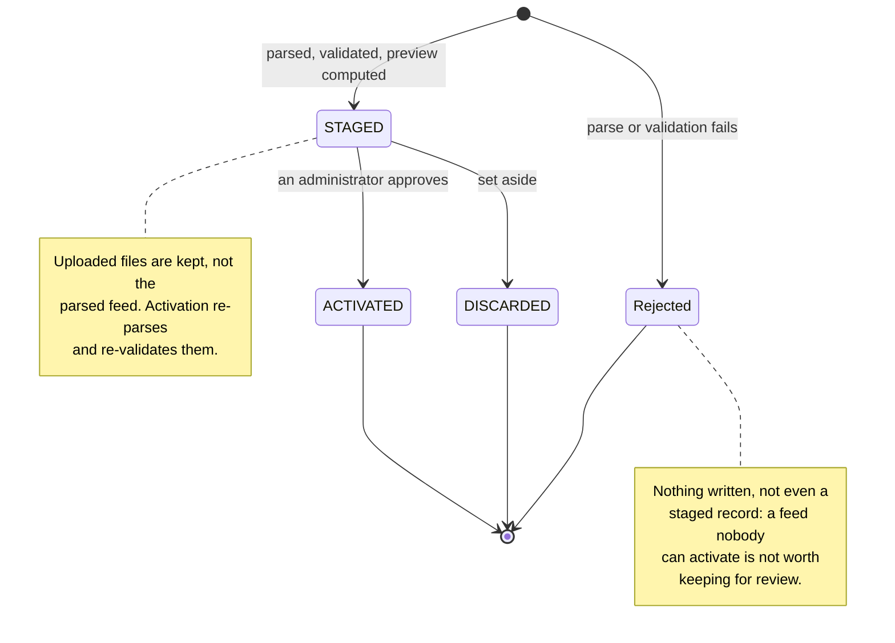
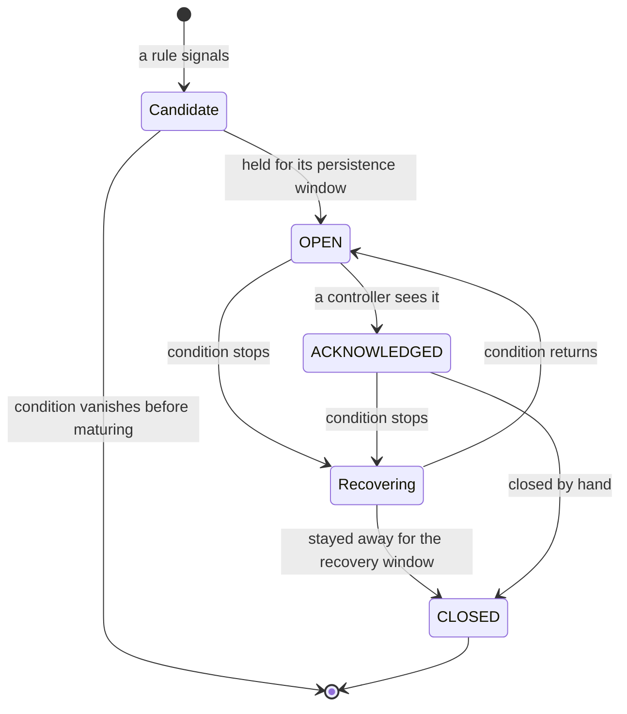
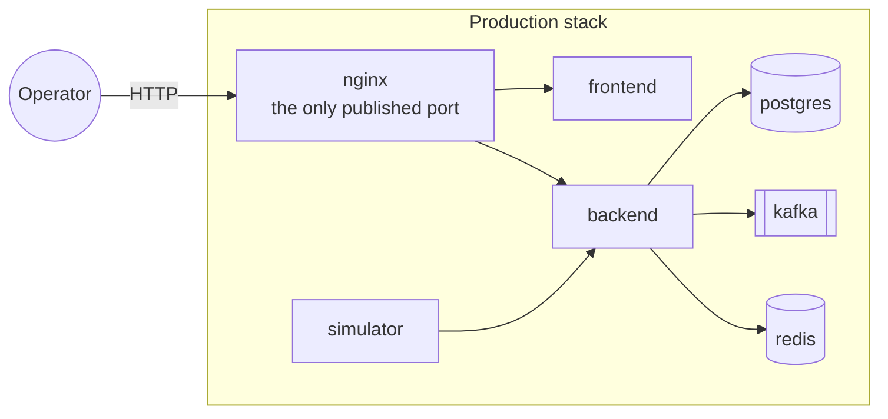

# MetroPulse Architecture

MetroPulse is a modular monolith. Capability packages — `telemetry`, `operations`, `alert`,
`incident`, `ev`, `playback`, `analytics`, `auth`, `realtime`, `schedule` — own their API,
application services, domain logic, persistence and tests. Packages are organised by what they are
about, not by which layer they sit in, so a change to how headway works is one directory rather than
four.

## Runtime

Redis is in both Compose stacks and used by nothing. It was provisioned for caching and rule
counters that PostgreSQL has handled adequately, and saying so is better than adding a decorative
cache.

## How one observation becomes state

The path that matters most, because everything operational is derived from it.

Three properties hold this together, and each has its own tests:

- **The outbox.** The observation and the event commit together, so the failure where a request
  succeeds and its event vanishes cannot happen.
- **At-least-once delivery, idempotent consumers.** The event id is claimed in `processed_event` in
  the same transaction as the projection, so Kafka redelivering is a no-op rather than a second
  application.
- **No rewind.** An event that arrives late is stored as history, but the upsert refuses to move
  current state backwards. One `WHERE` clause on the conflict branch.

## What is derived, and from what

The schedule is the reference every one of these comparisons is made against, which is why replacing
it is a reviewed decision rather than a side effect of an upload.

## Staged schedule import

## Alert lifecycle

`opened_at` records when the condition started, not when the engine noticed it had lasted, because
"how long has this been going on" is the question a controller actually asks.

## Deployment

PostgreSQL, Kafka, Redis and the backend are reachable only from inside the Compose network, so the
attack surface is one reverse proxy rather than five services. Every secret is required rather than
defaulted: a stack that silently starts with a development signing key is worse than one that
refuses to start.

## Where the detail is

| Question | Document |
|---|---|
| Why an outbox, and what it does not guarantee | [outbox.md](outbox.md) |
| Idempotent consumption, poison messages, dead-lettering | [kafka.md](kafka.md) |
| Projection, no-rewind, PostGIS, schedule adherence | [operational-state.md](operational-state.md) |
| Headway estimation and its speed basis | [headway-bunching.md](headway-bunching.md) |
| Deduplication, persistence windows, hysteresis | [alerts.md](alerts.md) |
| Incident workflow and charger concurrency | [incidents-and-ev.md](incidents-and-ev.md) |
| Replay and metrics | [playback-and-analytics.md](playback-and-analytics.md) |
| Staging, previewing and activating a feed | [schedule-import.md](schedule-import.md) |
| Tokens, roles, and two bugs the tests caught | [security.md](security.md) |
| What is built, verified, and not built | [status-and-roadmap.md](status-and-roadmap.md) |
